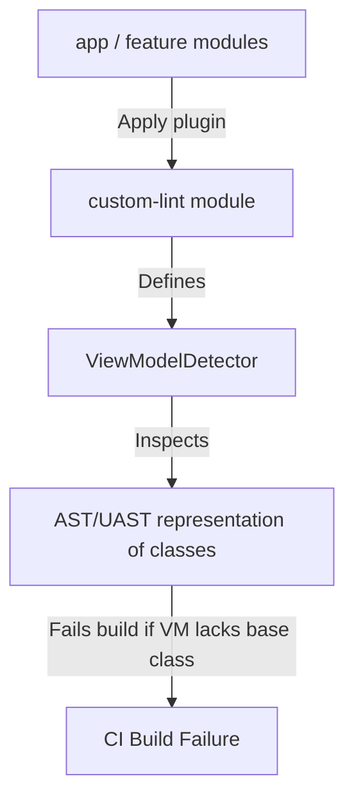

# Advanced CI/CD & Automation Pipelines

This document details the strategies and configuration blueprints for automating testing, static analysis, and releases in the **PortfolioMovies** project.

---

## 1. Matrix Testing with Gradle Managed Devices (GMD)

### Long-Term Vision
Connected UI tests run on physical or emulated devices. Provisioning and maintaining clean emulators locally or in CI is error-prone. Gradle Managed Devices (GMD) delegate emulator provisioning, startup, run, and teardown entirely to the Gradle build tool, ensuring consistent test environments and native scaling in parallel.

### Implementation Blueprint
Configure the GMD instances in the `android` block of your module's `build.gradle.kts` (or inside the shared Android convention plugin):

```kotlin
android {
    testOptions {
        managedDevices {
            devices {
                register<com.android.build.api.dsl.ManagedVirtualDevice>("pixel6Api33") {
                    device = "Pixel 6"
                    apiLevel = 33
                    systemImageSource = "aosp-atd" // "Automated Test Device" - lightweight, optimized emulator
                }
                register<com.android.build.api.dsl.ManagedVirtualDevice>("pixel2Api26") {
                    device = "Pixel 2"
                    apiLevel = 26
                    systemImageSource = "aosp-atd"
                }
            }
        }
    }
}
```

Run tests on GMD via command-line:
```bash
# Run on pixel6
./gradlew pixel6Api33DebugAndroidTest

# Run all GMD tests in parallel
./gradlew allDevicesDebugAndroidTest
```

---

## 2. Static Analysis & Custom Lint Rules

### Long-Term Vision
Maintaining architectural standards manually during code reviews increases team cognitive load and slows down pull requests. We automate style checks (Ktlint), static code analysis (Detekt), and architectural constraints (Custom Lint Rules) to catch deviations immediately.

### Custom Lint Rule Architecture
To enforce that *“all ViewModels must implement a standard architecture contract”* (such as extending a base or handling state using a specific pattern), we build a custom Lint rule.



### Implementation Blueprint for Custom Lint Rule
1. Create a Java/Kotlin-only module named `:core:lint`.
2. Add dependencies to its `build.gradle.kts`:
   ```kotlin
   dependencies {
       compileOnly("com.android.tools.lint:lint-api:31.2.1")
       testImplementation("com.android.tools.lint:lint-tests:31.2.1")
   }
   ```
3. Implement `ViewModelDetector.kt`:
   ```kotlin
   import com.android.tools.lint.detector.api.*
   import org.jetbrains.uast.UClass

   class ViewModelDetector : Detector(), SourceCodeScanner {
       override fun applicableSuperClasses(): List<String> = listOf("androidx.lifecycle.ViewModel")

       override fun visitClass(context: JavaContext, declaration: UClass) {
           val hasCorrectBase = declaration.supers.any { it.qualifiedName == "com.sortedqueue.portfolio.core.BaseViewModel" }
           if (!hasCorrectBase) {
               context.report(
                   ISSUE_BASE_VIEWMODEL,
                   declaration,
                   context.getNameLocation(declaration),
                   "ViewModels must inherit from com.sortedqueue.portfolio.core.BaseViewModel"
               )
           }
       }

       companion object {
           val ISSUE_BASE_VIEWMODEL = Issue.create(
               id = "EnforceBaseViewModel",
               briefDescription = "ViewModels must extend BaseViewModel",
               explanation = "We enforce extending BaseViewModel to standardize State and Intent routing across the app.",
               category = Category.CORRECTNESS,
               severity = Severity.ERROR,
               implementation = Implementation(ViewModelDetector::class.java, Scope.JAVA_FILE_SCOPE)
           )
       }
   }
   ```
4. Expose the rule via an `IssueRegistry` and consume it in modules via `lintChecks(project(":core:lint"))`.

---

## 3. Automated Release Trains (Fastlane)

### Long-Term Vision
Developers should never manually sign or upload APKs/AABs from Android Studio. We automate delivery from the command-line or CI/CD pipelines using Fastlane.

### Automation Stack
*   **Fastlane**: Manages Gradle tasks, interacts with Google Play Developer Console API, and handles screenshot uploads.
*   **Fastlane Screengrab**: Automates UI walkthroughs on a GMD emulator to capture and crop store screenshots in multiple locales.
*   **Changelog Generator**: Extracts conventional commit descriptions (`feat:`, `fix:`) between tags to compile automated, human-readable release notes.

### Example Fastlane configuration (`fastlane/Fastfile`)
```ruby
default_platform(:android)

platform :android do
  desc "Submit a new Beta Build to Google Play Track"
  lane :beta do
    gradle(task: "clean")
    gradle(task: "bundleRelease")
    
    # Upload to Play Console
    upload_to_play_store(
      track: 'beta',
      package_name: 'com.sortedqueue.portfolio',
      json_key: 'play_service_account_key.json',
      aab: 'app/build/outputs/bundle/release/app-release.aab'
    )
  end
end
```
