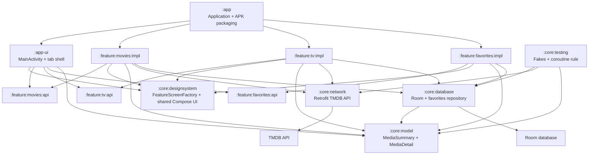

# Architecture Diagram

This diagram shows how the app modules relate to each other at a high level.

## Notes

- `:app-ui` depends on feature API boundaries, not feature implementations.
- `:app` depends on implementation modules so Hilt can discover their bindings at the application graph level.
- `FeatureScreenFactory` allows feature screens to be contributed into the app shell with Hilt multibindings.
- Shared domain-style UI models live in `:core:model` to avoid coupling feature implementations to each other.
