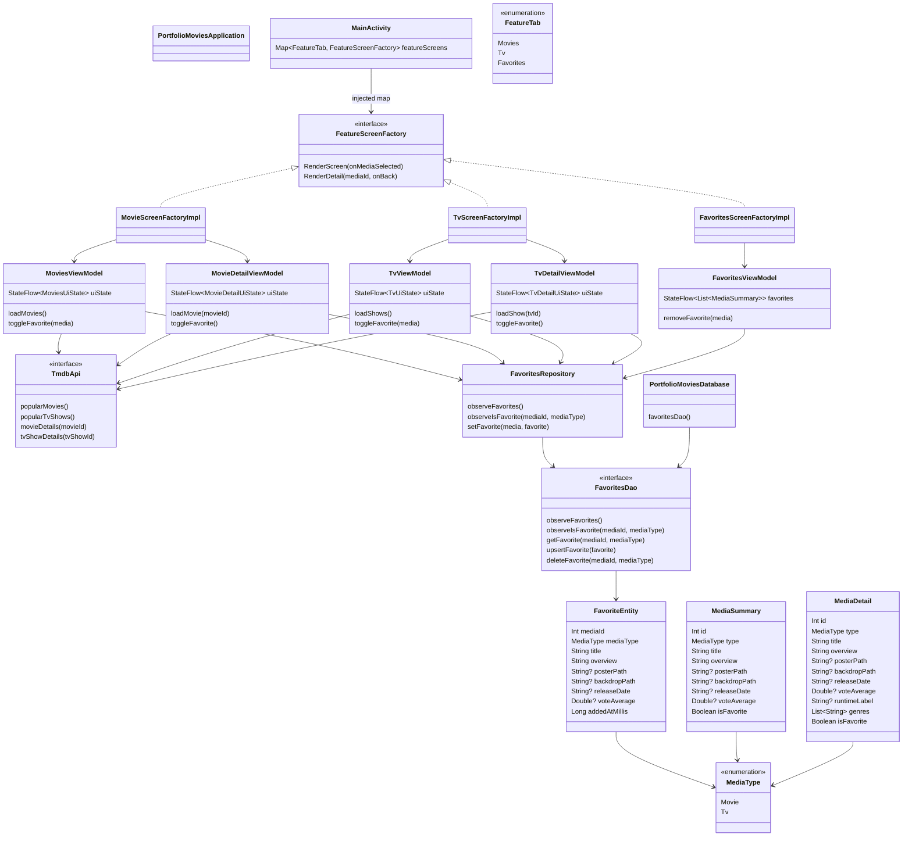

# Class Diagram

This class diagram focuses on the app-owned classes and their main relationships. Generated Hilt and Room classes are intentionally omitted.

```mermaid
classDiagram
    class PortfolioMoviesApplication
    class MainActivity {
        Map~FeatureTab, FeatureScreenFactory~ featureScreens
    }

    class FeatureScreenFactory {
        <<interface>>
        RenderScreen(onMediaSelected)
        RenderDetail(mediaId, onBack)
    }

    class FeatureTab {
        <<enumeration>>
        Movies
        Tv
        Favorites
    }

    class MediaType {
        <<enumeration>>
        Movie
        Tv
    }

    class MediaSummary {
        Int id
        MediaType type
        String title
        String overview
        String? posterPath
        String? backdropPath
        String? releaseDate
        Double? voteAverage
        Boolean isFavorite
    }

    class MediaDetail {
        Int id
        MediaType type
        String title
        String overview
        String? posterPath
        String? backdropPath
        String? releaseDate
        Double? voteAverage
        String? runtimeLabel
        List~String~ genres
        Boolean isFavorite
    }

    class TmdbApi {
        <<interface>>
        popularMovies()
        popularTvShows()
        movieDetails(movieId)
        tvShowDetails(tvShowId)
    }

    class FavoritesDao {
        <<interface>>
        observeFavorites()
        observeIsFavorite(mediaId, mediaType)
        getFavorite(mediaId, mediaType)
        upsertFavorite(favorite)
        deleteFavorite(mediaId, mediaType)
    }

    class FavoritesRepository {
        observeFavorites()
        observeIsFavorite(mediaId, mediaType)
        setFavorite(media, favorite)
    }

    class PortfolioMoviesDatabase {
        favoritesDao()
    }

    class FavoriteEntity {
        Int mediaId
        MediaType mediaType
        String title
        String overview
        String? posterPath
        String? backdropPath
        String? releaseDate
        Double? voteAverage
        Long addedAtMillis
    }

    class MoviesViewModel {
        StateFlow~MoviesUiState~ uiState
        loadMovies()
        toggleFavorite(media)
    }

    class MovieDetailViewModel {
        StateFlow~MovieDetailUiState~ uiState
        loadMovie(movieId)
        toggleFavorite()
    }

    class TvViewModel {
        StateFlow~TvUiState~ uiState
        loadShows()
        toggleFavorite(media)
    }

    class TvDetailViewModel {
        StateFlow~TvDetailUiState~ uiState
        loadShow(tvId)
        toggleFavorite()
    }

    class FavoritesViewModel {
        StateFlow~List~MediaSummary~~ favorites
        removeFavorite(media)
    }

    class MovieScreenFactoryImpl
    class TvScreenFactoryImpl
    class FavoritesScreenFactoryImpl

    MainActivity --> FeatureScreenFactory : injected map
    FeatureScreenFactory <|.. MovieScreenFactoryImpl
    FeatureScreenFactory <|.. TvScreenFactoryImpl
    FeatureScreenFactory <|.. FavoritesScreenFactoryImpl

    MovieScreenFactoryImpl --> MoviesViewModel
    MovieScreenFactoryImpl --> MovieDetailViewModel
    TvScreenFactoryImpl --> TvViewModel
    TvScreenFactoryImpl --> TvDetailViewModel
    FavoritesScreenFactoryImpl --> FavoritesViewModel

    MoviesViewModel --> TmdbApi
    MoviesViewModel --> FavoritesRepository
    MovieDetailViewModel --> TmdbApi
    MovieDetailViewModel --> FavoritesRepository
    TvViewModel --> TmdbApi
    TvViewModel --> FavoritesRepository
    TvDetailViewModel --> TmdbApi
    TvDetailViewModel --> FavoritesRepository
    FavoritesViewModel --> FavoritesRepository

    FavoritesRepository --> FavoritesDao
    PortfolioMoviesDatabase --> FavoritesDao
    FavoritesDao --> FavoriteEntity
    FavoriteEntity --> MediaType
    MediaSummary --> MediaType
    MediaDetail --> MediaType
```
