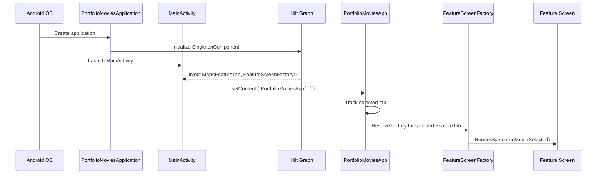
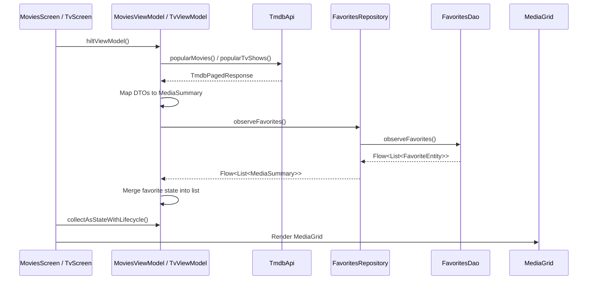
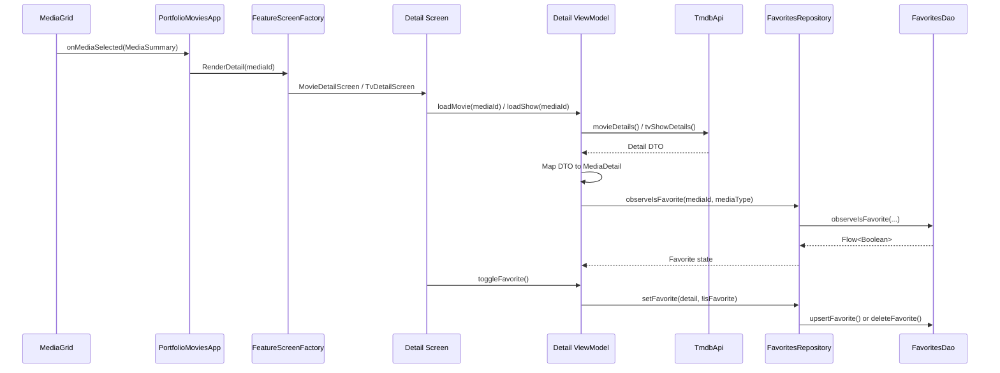
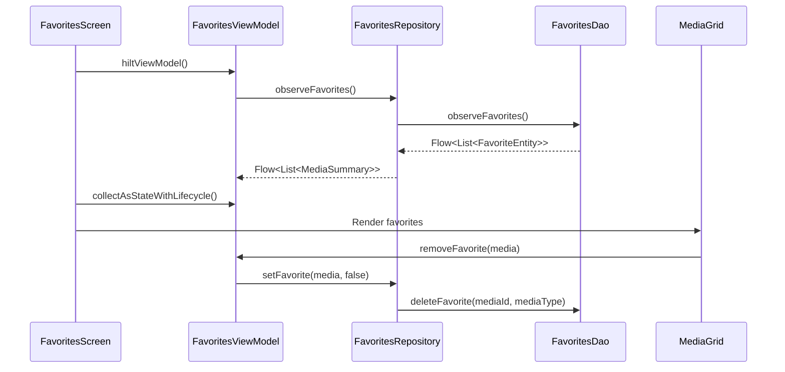

# Code Flow Diagrams

## App Startup And Tab Rendering

```mermaid
sequenceDiagram
    participant Android as Android OS
    participant App as PortfolioMoviesApplication
    participant Activity as MainActivity
    participant Hilt as Hilt Graph
    participant Shell as PortfolioMoviesApp
    participant Factory as FeatureScreenFactory
    participant Screen as Feature Screen

    Android->>App: Create application
    App->>Hilt: Initialize SingletonComponent
    Android->>Activity: Launch MainActivity
    Hilt-->>Activity: Inject Map<FeatureTab, FeatureScreenFactory>
    Activity->>Shell: setContent { PortfolioMoviesApp(...) }
    Shell->>Shell: Track selected tab
    Shell->>Factory: Resolve factory for selected FeatureTab
    Factory->>Screen: RenderScreen(onMediaSelected)
```

## Movies/TV List Loading

```mermaid
sequenceDiagram
    participant Screen as MoviesScreen / TvScreen
    participant VM as MoviesViewModel / TvViewModel
    participant Api as TmdbApi
    participant Repo as FavoritesRepository
    participant Dao as FavoritesDao
    participant UI as MediaGrid

    Screen->>VM: hiltViewModel()
    VM->>Api: popularMovies() / popularTvShows()
    Api-->>VM: TmdbPagedResponse
    VM->>VM: Map DTOs to MediaSummary
    VM->>Repo: observeFavorites()
    Repo->>Dao: observeFavorites()
    Dao-->>Repo: Flow<List<FavoriteEntity>>
    Repo-->>VM: Flow<List<MediaSummary>>
    VM->>VM: Merge favorite state into list
    Screen->>VM: collectAsStateWithLifecycle()
    Screen->>UI: Render MediaGrid
```

## Detail Screen And Favorite Toggle

```mermaid
sequenceDiagram
    participant Grid as MediaGrid
    participant Shell as PortfolioMoviesApp
    participant Factory as FeatureScreenFactory
    participant Detail as Detail Screen
    participant VM as Detail ViewModel
    participant Api as TmdbApi
    participant Repo as FavoritesRepository
    participant Dao as FavoritesDao

    Grid->>Shell: onMediaSelected(MediaSummary)
    Shell->>Factory: RenderDetail(mediaId)
    Factory->>Detail: MovieDetailScreen / TvDetailScreen
    Detail->>VM: loadMovie(mediaId) / loadShow(mediaId)
    VM->>Api: movieDetails() / tvShowDetails()
    Api-->>VM: Detail DTO
    VM->>VM: Map DTO to MediaDetail
    VM->>Repo: observeIsFavorite(mediaId, mediaType)
    Repo->>Dao: observeIsFavorite(...)
    Dao-->>Repo: Flow<Boolean>
    Repo-->>VM: Favorite state
    Detail->>VM: toggleFavorite()
    VM->>Repo: setFavorite(detail, !isFavorite)
    Repo->>Dao: upsertFavorite() or deleteFavorite()
```

## Favorites Tab

```mermaid
sequenceDiagram
    participant Screen as FavoritesScreen
    participant VM as FavoritesViewModel
    participant Repo as FavoritesRepository
    participant Dao as FavoritesDao
    participant Grid as MediaGrid

    Screen->>VM: hiltViewModel()
    VM->>Repo: observeFavorites()
    Repo->>Dao: observeFavorites()
    Dao-->>Repo: Flow<List<FavoriteEntity>>
    Repo-->>VM: Flow<List<MediaSummary>>
    Screen->>VM: collectAsStateWithLifecycle()
    Screen->>Grid: Render favorites
    Grid->>VM: removeFavorite(media)
    VM->>Repo: setFavorite(media, false)
    Repo->>Dao: deleteFavorite(mediaId, mediaType)
```
