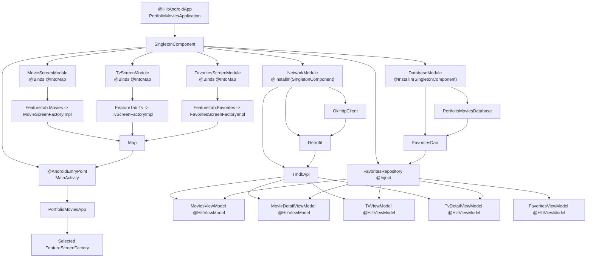

# Dependency Injection Flow

The app uses Hilt for dependency injection. The application module depends on feature implementation modules so Hilt can aggregate feature bindings into the app graph.

## Binding Summary

| Binding | Provider | Scope |
| --- | --- | --- |
| `OkHttpClient` | `NetworkModule.provideOkHttpClient()` | `@Singleton` |
| `Retrofit` | `NetworkModule.provideRetrofit()` | `@Singleton` |
| `TmdbApi` | `NetworkModule.provideTmdbApi()` | `@Singleton` |
| `PortfolioMoviesDatabase` | `DatabaseModule.provideDatabase()` | `@Singleton` |
| `FavoritesDao` | `DatabaseModule.provideFavoritesDao()` | Unscoped provider |
| `FavoritesRepository` | `@Inject constructor` | `@Singleton` |
| `FeatureScreenFactory` map entries | Feature `@Binds @IntoMap` modules | `SingletonComponent` |
| Feature ViewModels | `@HiltViewModel @Inject constructor` | ViewModel scope |

## Why The App Module Depends On Feature Implementations

`:app-ui` only needs the feature API contracts and shared `FeatureScreenFactory` type. The final `:app` module depends on each feature implementation so Hilt can discover and aggregate:

- `MovieScreenModule`
- `TvScreenModule`
- `FavoritesScreenModule`
- all `@HiltViewModel` classes in feature modules

This keeps the shell decoupled while still allowing the final application graph to include all feature bindings.
